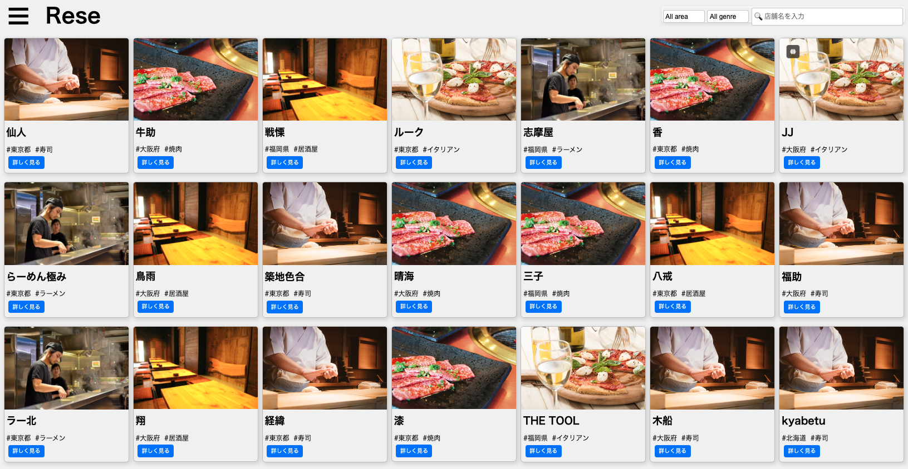

# アプリケーション名

### 飲食店予約アプリ

### サービス名

Rese


## 作成目的

外部の飲食店予約サービスは手数料を取られるので自社で予約サービスを持ちたい

## 概要説明

トップページに登録された店舗一覧が表示され各店舗の「詳しく見る」ボタンを押すと詳細画像と予約画面が表示される<br>
　ユーザー登録すると店舗毎に「お気に入り登録」と「店舗予約」することができ、登録詳細はハンバーガーアイコン内のマイページ項目から閲覧可能<br>
店舗編集権限者は新たな店舗の追加・権限が付与された店舗の削除ができる<br>
管理者は上記＋店舗編集権限者の設定及びユーザーへのメール一斉送信が出来る。

# 機能一覧

    会員登録
    ログイン
    ログアウト
    ユーザー情報取得
    ユーザー飲食店お気に入り一覧取得
    ユーザー飲食店予約情報取得
    飲食店一覧取得
    飲食店詳細取得
    飲食店お気に入り追加
    飲食店お気に入り削除
    飲食店予約情報追加
    飲食店予約情報削除
    エリアで検索する
    ジャンルで検索する
    店名で検索する
    飲食店編集機能
    飲食店新規作成機能
    店舗代表者登録
    管理者登録
    新規登録者メール認証
    お知らせメール送信
    口コミ投稿
    口コミ編集
    店舗登録をcsvでインポート取得

# テーブル設計

https://docs.google.com/spreadsheets/d/1t10kDiHte8iT4K38IrfgD2TRnGLOOVzZAmaw8B5qePE/edit#gid=1270192593
　　内、テーブル仕様書シート参照
    ※赤字部Pro追加分

# ER 図

https://docs.google.com/spreadsheets/d/1t10kDiHte8iT4K38IrfgD2TRnGLOOVzZAmaw8B5qePE/edit#gid=1270192593
　　内、ER 図シート参照
    ※赤字部Pro追加分

## 使用技術

- Laravel 8.83.27
- php 8.0
- mysql 8.0.26
- nginx 1.21.1

## 環境構築

以下の手順に従って環境構築をして下さい。

### 1.GIT リポジトリをクローンして下さい。

```
git@github.com:kazuyuki-okada5/20240907_res_okada.git
```

### 2.Docker と Docker Composer をインストールして下さい。

インストール済みの場合は省略して下さい。

### 3.プロジェクトのルートディレクトリに移動しているか確認して下さい。

```
cd 20240907_res_okada
```

### 4.`.env.example`ファイルをコピーして`.env`ファイルを作成して下さい。

```
cd src
cp .env.example .env
```

### 5..env ファイルを開き、以下の環境変数を設定して下さい。

```
DB_CONNECTION=mysql
DB_HOST=mysql
DB_PORT=3306
DB_DATABASE=laravel_db
DB_USERNAME=laravel_user
DB_PASSWORD=laravel_pass
```

```
MAIL_FROM_ADDRESS=your-email@example.com
```

### 6.docker を起動しビルドして下さい。

```
docker-compose up -d --build
```

### 7.srcフォルダ内のcomposer.jsonディレクトリを開き以下のように変更して下さい

```
    "require": {
        "php": "^7.4",を"php": "^7.4 || ^8.0",
```

### 8.php コンテナに入り Composer をインストール後、暗号化キーを作成して下さい。

```
docker-compose exec php bash
apt-get update && apt-get install -y libpng-dev
docker-php-ext-install gd
composer install
php artisan key:generate
```

### 9.マイグレーションリフレッシュ及びシーディングを実行して下さい。

```
php artisan migrate:refresh --seed
```

### 10.ローカルへのアクセス

1.〜８.までの作業が滞りなく終了したら下記リンク先からアプリケーションが開きます。<br>
[トップページ](http://localhost/)

### 11.ログインパスワード

ユーザー用 <br>
メールアドレス:a@co.jp <br>
パスワード:aaaaaaaa

管理者用 <br>
メールアドレス:aaaa@co.jp <br>
パスワード:aaaaaaaa

※管理者用のパスワードを使用するとアプリ内新規プロフィール作成以外全ての認証必須ページを閲覧することが出来ます。

### 12.CSVインポート機能は下記をコピーして.空のCSVファイルに貼り付けてインポートして下さい。

```
name,area,genre,store_overview,image_url
寿司太郎,東京都,寿司,最高の寿司を提供するお店です。,"https://coachtech-matter.s3-ap-northeast-1.amazonaws.com/image/sushi.jpg"
焼肉キング,大阪府,焼肉,美味しい焼肉をお楽しみください。,"https://coachtech-matter.s3-ap-northeast-1.amazonaws.com/image/yakiniku.jpg"
ラーメン一番,福岡県,ラーメン,博多の味をそのまま再現したラーメン店です。,"https://coachtech-matter.s3-ap-northeast-1.amazonaws.com/image/ramen.jpg"
イタリアンマリオ,東京都,イタリアン,厳選素材を使用した本格イタリアン。,"https://coachtech-matter.s3-ap-northeast-1.amazonaws.com/image/italian.jpg"
居酒屋花,大阪府,居酒屋,おいしいお酒と食事を楽しめる居酒屋です。,"https://coachtech-matter.s3-ap-northeast-1.amazonaws.com/image/izakaya.jpg"
```

管理者でログイン後、メインページ右上の「管理者ページ」ボタンを押すと管理者用ホーム画面に移動するので、画面下部のCSVインポートフォームに移動し、上記で作成したCSVファイルをドラック&ドロップするか、破線内をクリックすると挿入したいファイルを選択ができるので、どちらかでファイルを挿入して下さい。（挿入後、インポートボタンを押し、成功メッセージ確認後、ハンバーガーメニューからHOMEボタンで店舗一覧ページに移動すると既存の店舗一覧の後にインポートした店舗が追記されています。）

### 13.その他注意点

ログインする時に再度ログインを求められる不具合が発生する場合があります。再度パスワード入力後ログインして下さい。